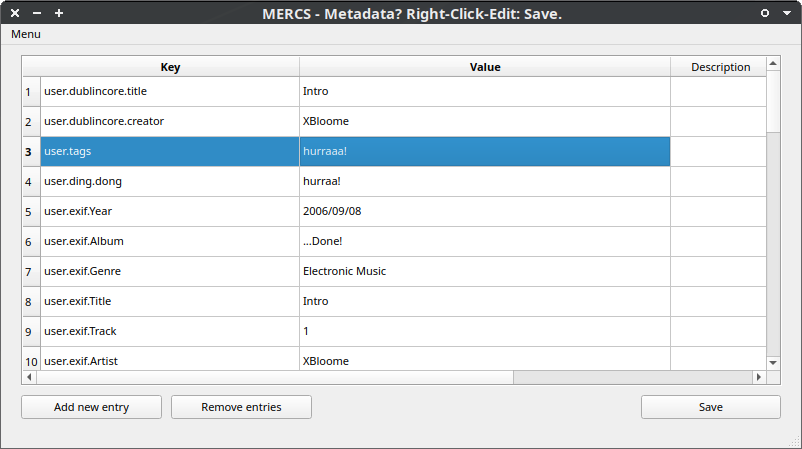
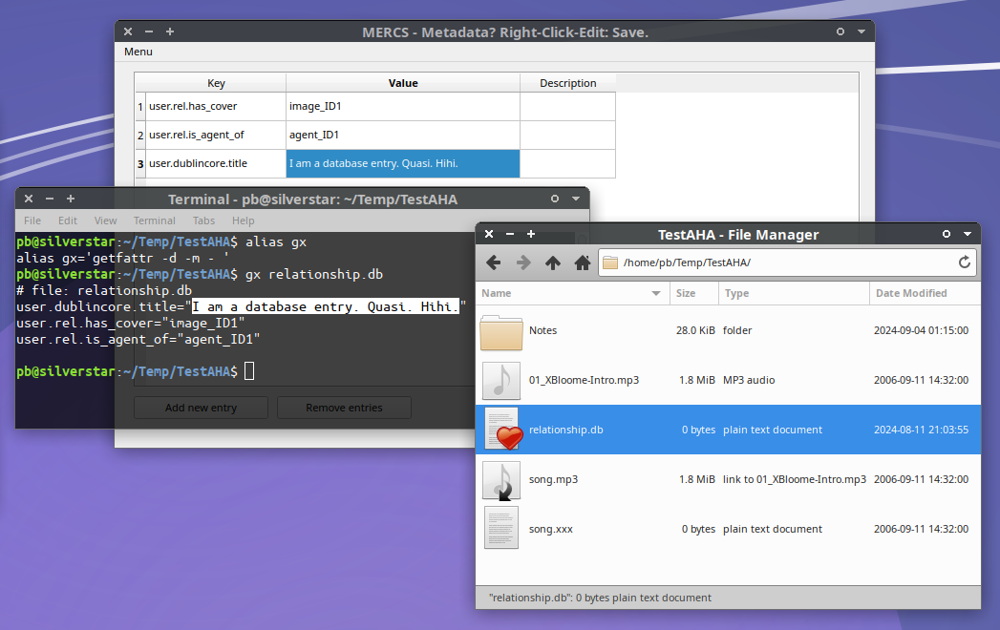
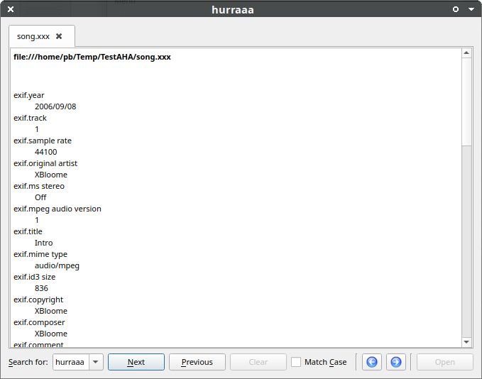

# mercs

A simple GUI to view &amp; edit xattrs (extended file attributes) in Python+Qt, using `xattr` (v0.9.6) library.

# What does "MERCS" stand for?

> "Metadata Edit? Right-click: Save."

It's part of a metadata/annotation environment, where one can literally access *any* data (metadata+payload) as easy as "right-click-edit-save" 😄
Working title: [AHAlodeck by August](https://github.com/ArkThis/AHAlodeck)

# What are xattrs?

`xattrs` is a term for "Extended File Attributes" (EAs): key/value metadata stored in the filesystem (<- That's where filename/path and timestamps are stored now).
MERCS accesses these EAs, and shows them as simple key/value set in an editable table.

# What's the plan?

This is a very hacky, and not well-coded proof-of-concept UI for editing filesystem EAs.
The plan is to extend MERCS functionalities as follows:

  * Add search/filter capabilities
  * Add display hierarchy as-tree options (like a file-manager)
  * Regroup on-the-fly by patterns
  * Interpret URIs in values as "linked-data-objects"
  * Support graph-queries (RDF?)

Have fun! 🍰

# Known Issues

Currently, mercs will close itself immediately if a file has *no attributes* yet set.
So you need to use `setfattr` to give it an initial value - and then use mercs to add more.

# Screenshots

## A 0-Byte file containing only metadata, shown in 2 different tools:

## Recoll (search tool) showing that MERCS really looks at the same filesystem data (xattrs)

## MERCS as right-click custom config in file-manager (Thunar XFCE4)

